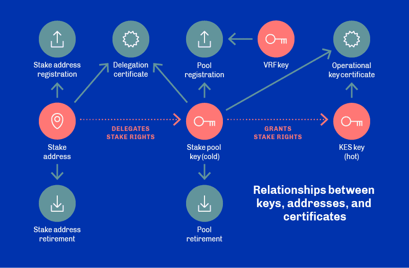

# Cryptography

---
## Primitives
Cardano uses asymmetric key and certification primitives to secure the interactions between network participants:

  
Source: https://docs.cardano.org/core-concepts/cardano-keys

### Asymmetric Keys
Asymmetric keys are used by nodes and addresses:
- Node Keys:
  - **Stake pool key pair** (cold): used to create operational certificates for each KES period, granting stake rights
  - **Key Evolving Signature (KES) key pair** (hot): key used to authenticate node and for signing blocks, which
    expires periodically (90 days)
  - **VRF key pair**: signing verification key, used to verify a slot leader and stored within *operational certificate*
- Address Keys:
  - **Payment key pair**: used for generating UTXO addresses
  - **Staking key pair**: generating stake account/reward addresses

### Certifications
Cardano uses certifications in two places:
- **Operational certificates**:
  - Used by staking pools, generated offline before being copied to node to validate KES keys used to sign blocks
  - link between offline key and operational key, which verifies stake pool has authority to run
  - include an issue counter number, higher number replaces existing if compromised
  - included in header of each block node generates
- **Delegation certificates**:
  - Staking address registration certificate: creates a staking address by a user looking to delegate block-signing
    rights to a stake pool
  - Delegation certificate: details stake being delegated to a particular stake pool

### Exotic Primitives

#### Additive Homomorphic Encryption
Post-Voting: enables generation of the seed for the next round, which can be decrypted by _t_ of _n_ committee
members. An implementation can be found [here](https://github.com/aistcrypt/Lifted-ElGamal).

#### Non-Interactive Zero Knowledge (NIZK's)
Voting and Post-Voting: the world's first honest ZK verifier, which is used to tally votes.

#### Pederson Commitments
Voting: used to anonymize votes for a proposal.

#### Sealed Glass Proofs
Sealed Glass Proofs are proposed in the Cardano Computation Layer, which are a form of zero knowledge proof on a
secure enclave.[^1]

#### Verifiable Random Functions
Cardano uses the ECVRF-ED25519-SHA512-Elligator2* verifiable random function via the `verifyVrf` function, during block 
production:
* Used by Ouroboros Praos consensus mechanism for private slot leader selection. Leader selection was public in 
  previous versions of the protocol, so anyone could determine which node had the right to produce a block.
* Using VRFs keeps the slot leader schedule private until a leader is selected. The slot leader can then prove to
  everyone that they are using the VRF key and produce a block.

### Digital Signatures
The chain currently only supports EdDSA and Curve25519 for signing and verification (with added support for HD 
wallets), but ECDSA SECP256k1 and Schnorr Ed25519 are due imminently for improved interoperability[^2]. 

Other signatures maybe added through soft forks (in particular BLISS-B for anti-quantum).

#### Key evolving signatures (KES)
Key evolving signatures (KES) according to the MMM scheme. These type of signature schemes provide forward 
cryptographic security, meaning that a compromised key does not make it easier for an adversary to forge a signature 
that allegedly had been signed in the past. In KES, the public verification key stays constant, but the 
corresponding private key evolves incrementally. 

For this reason, KES signing keys are indexed by integers representing the step in the key’s evolution. This 
evolution step parameter is also an additional parameter needed for the signing (denoted by `sign ev`) and 
verification (denoted by `verify ev`) functions. Since the private key evolves incrementally in a KES scheme, the 
ledger rules require the pool operators to evolve their keys every time a certain number of slots have passed, as 
determined by the global constant `SlotsPerKESPeriod`.

#### Multi-Signatures 
Cardano allows multi-signatures via multi-signature scripts. The terms form a tree like structure and are evaluated 
via the `evalMultiSigScript` function. The parameters are a script and a set of key hashes. The function returns 
`True` when the supplied key hashes are a valid combination for the script, otherwise it returns `False`.

### Hashing
The hashing algorithm for all verification keys and multi-signature scripts is BLAKE2b-224 (64 bit). Explicitly, 
this is the payment and stake credentials, the genesis keys and their delegates, stake pool verification keys, and 
VRF verification keys.

BLAKE2b-256 (also 64bit) is used everywhere else (e.g. block headers, block bodies, block transactions, epochs, 
transaction and pool metadata).

#### Hash-Based Data Structures
Cardano uses an **Extended UTXO**[^3] model and due to its stateless nature (in comparison to the
account-based model), no explicit descriptions of the usage of hash-based data structures were found in the literature.
Further research into the underlying codebase did indeed show the current usage of merkle trees in UTXO transaction
proofs and the block body hash[^4]. More widespread use of merkle trees is planned in the upcoming Hydra
implementation of the protocol (instead of Merkle Patricia Tries which were deemed to be too expensive to use on-chain).

### Pros/Cons

#### Pros
1. Usage of additive homomorphic encryption to encrypt the random seed for voting. This enables the seed to be decrypted with only a threshold of signers.
2. Usage of NIZKs to hide the vote from each voter

#### Cons
1. The dependence on Sealed Glass Proofs to power the CCL increases the barrier of entry for regular validators who don't have machines with secure enclaves.
2. Computational overhead due to the use of so many exotic cryptographic primitives.

---

#### Commonly used primitives in Governance

- Digital signatures
  - [Pre-Voting] Signing keys are freshly generated to vote for each proposal
- One way hash functions
  - [Pre-Voting] To generate the voter ID, and expert ID, which are hashes of the signing key generated for each proposal
- Public-key cryptography
  - [All-stages] Are used to sign transactions that are broadcasted onto the network
- Commitment scheme
  - [Pre-Voting] The seed which is used to select a random group of committee members to tally and execute votes is committed in the previous voting round, and revealed at the start of the new voting round

---
### Footnotes
[^1]: Sealed Glass Proofs - https://eprint.iacr.org/2016/635.pdf  
[^2]: https://iohk.io/en/blog/posts/2022/07/08/bridges-and-sidechains-wanchain-making-cardano-interoperable/  
[^3]: https://docs.cardano.org/plutus/eutxo-explainer
