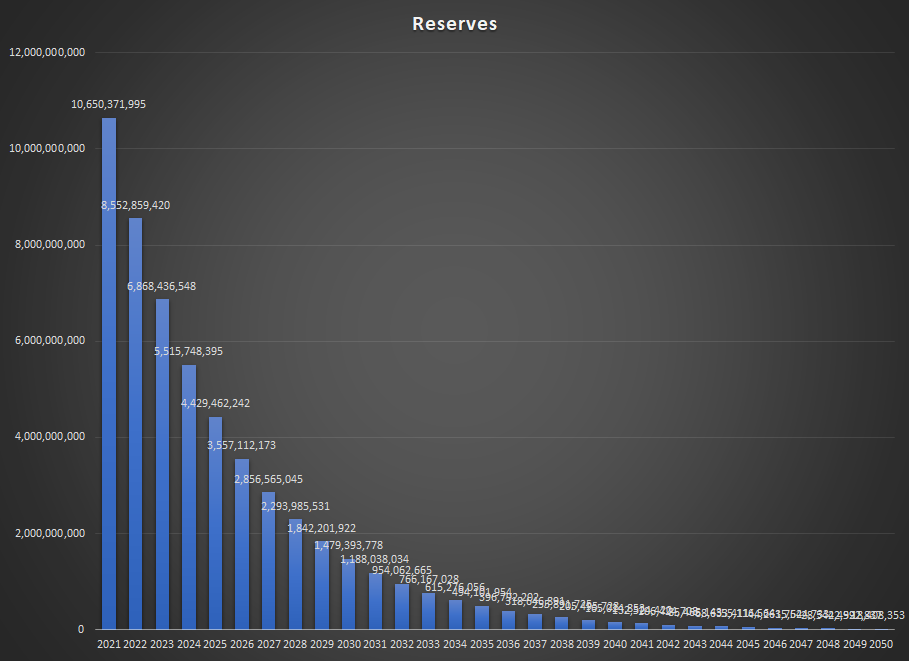
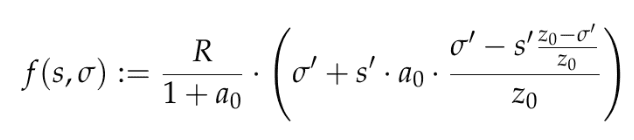
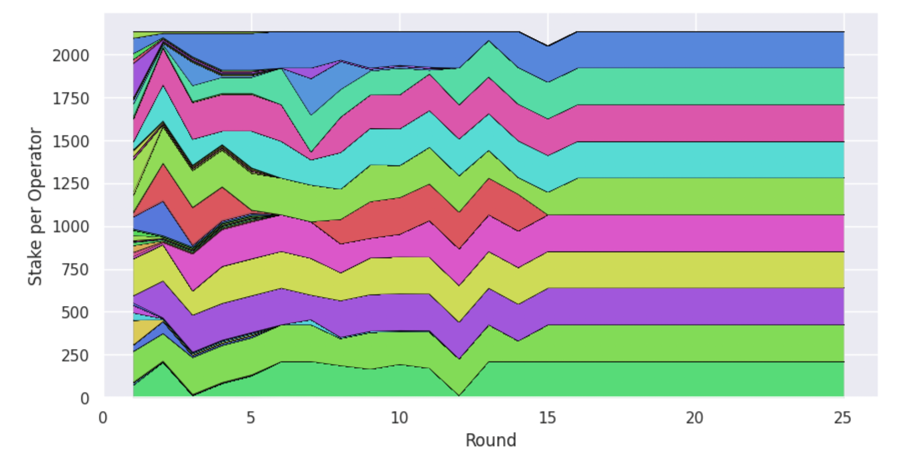

# Economics

---

A portmanteau of “token” and “economics”, tokenomics is a catch-all for the elements that make a particular 
cryptocurrency valuable and interesting to people who want to participate in the network. That includes everything 
from a token’s supply and how it’s issued to things like what utility it has.

First, a short overview of the tokenomics: the initial token distribution, supply schedule, and rate of inflation, 
are provided. Then, the token utility is discussed which will be followed by the network incentives. Here we will go in 
depth on how the participants of the Cardano ecosystem are incentivized through game theory.

# Tokenomics

### Native Token
The native token is ADA, named after Ada Lovelace, an English mathematician[^1], which is used for fees, rewards
and deposits.

Cardano does also have multi-asset support via "native tokens"[^2], but usage does not have any direct economic impact on
the network.

### Initial Distribution
There was a public sale of 25.9 billion ADA and an additional 5.2 billion ADA (20% of public) was allocated to the
three entities supporting the ongoing development of the project:

| Seed Sale                                           | Amount                   |
|-----------------------------------------------------|--------------------------|
| Public                                              | 25.9 billion ADA (57.6%) |
| [IOHK](https://iohk.io) (development company)       | 2.46 billion ADA (5.5%)  |
| [EMURGO](https://emurgo.io) (commercial adoption)   | 2.07 billion ADA (4.6%)  |
| [Cardano Foundation](https://cardanofoundation.org) | 640 million ADA (1.4%)   |
| Reserve / Uncirculated                              | 13.9 billion ADA (30.9%) |

### Supply Schedule
Cardano currently has approximately 75% of its tokens in circulating supply:

| Supply              | Amount                |
|---------------------|-----------------------|
| Initial Supply      | 31.8 billion ADA      |
| Circulating Supply* | 33.93 billion ADA[^3] |
| Max Supply          | 45 billion ADA        |

'* The top 100 addresses on network hold ~17% circulating supply.

### Inflation
Expansion of the circulating supply comes from the *reserve*, where `reserve = max supply - total supply` and
`total supply = ADA in circulation plus ADA in treasury`. Expansion is non-linear, greater amounts released during
first years but decreases over time until most rewards will come from transaction fees. The supply schedule can
therefore be described as monotonically decreasing inflation.

  
Source: https://forum.cardano.org/t/how-does-cardano-reach-its-supply-cap-via-staking/39697/8

The rate of inflation is 0.3% of the reserve per epoch (every 5 days), where:
- 80% will be used to reward staking pools
- 20% goes to the treasury

### Token Utility
The token has three main uses, which will be discussed in more detail in the following sections:
* **Staking**: ADA stakers delegate to stake pools and earn rewards for securing the network
* **Fees**: transaction fees paid in ADA
* **Governance**: ADA stakers participate in governance and vote on CIPs

#### Staking 
ADA held on the Cardano network represents a user’s stake in the protocol, the size of which is proportional to the 
amount of ADA held. Important to note is that unlike other protocols, ADA token holders don't have to lock up their 
tokens. Users who hold a stake in Cardano can earn passive rewards for validating blocks. The amount of rewards they 
can earn is proportional to the amount of ADA they pledge or delegate to a stake pool.

#### Stake Pools
Stake pools may be either public or private. A public stake pool is a Cardano network node with a public address 
that other users can delegate to, and receive rewards. Private stake pools only deliver rewards to their owners.

Stake pools are run by a reliable operator: an individual or business with the knowledge and resources to run the 
node on a consistent basis. ADA holders can delegate to public stake pools if they wish to participate in the protocol 
and receive rewards, but do not wish to operate a Cardano network node themselves.

The more stake that is delegated to a stake pool, the greater chance it has of being selected as a slot leader. Each 
time it is selected and produces a block that is accepted onto the blockchain, it is rewarded, and these rewards are 
shared between the stake pool operator and stake pool delegators.

#### Saturation Parameter (*k*) (-> Decentralization Incentives)
Saturation is a term used to indicate that a particular stake pool has more stake delegated to it than is ideal for 
the network, while *k* is the targeted number of desired pools (currently 500 -> 64 million per stake pool). Once a 
pool reaches the point of saturation, it will offer diminishing rewards. The saturation mechanism was designed to 
prevent centralization by encouraging delegators to delegate to different stake pools, and to incentivize operators 
to set up alternative pools so that they can continue earning maximum rewards. Saturation, therefore, exists to 
preserve the interests of both ADA holders delegating their stake and stake pool operators, and to prevent any 
single pool from becoming too large.

#### Pledging 
The pledge is the amount of ADA that the stake pool operator ‘delegates’ to their own pool when it is created. This 
pledge represents the operator's commitment to maintain their pool and support network activity. Making a pledge is 
not required, however, it is recommended to pledge some ADA to the stake pool prior to running it. The more ADA that 
is pledged, the higher the pool rewards, which makes the pool more attractive to delegators. 

The pledge is declared during pool registration, (alongside the cost and margin values), and has to be honored by 
the pool owners who are delegating to the pool: If they collectively delegate less than the declared pledge, pool 
rewards for that epoch will be zero. Note that the pool will be public, if its operator margin is set to less than 100%.

#### Delegating
Delegators delegate their stake to a staking pool and get rewarded proportionally to their stake. When it is time to 
receive rewards as a delegator, a snapshot will be taken and your current balance at that time will be used to 
calculate your reward. Pools with a high pledge and a low margin are the most interesting for delegators.

## Rewards
To clarify, the higher the pledge of a stake pool, the higher the rewards. The higher the total stake, the greater 
the probability the stake pool will be elected to produce blocks.

Stake pools are rewarded by the sum of:
- 80% of the monetary expansion.
- All the transaction fees during the new epoch.
- Fixed costs - a fixed fee of 340 ADA to every pool (covers the pool's operating costs).

### Reward Mechanics
The following formula outlines how the rewards mechanism works. The available rewards amount, transaction fees, plus 
monetary expansion, is denoted by *R*. First, the share of all available rewards that a specific pool can receive is 
determined, as follows:

  
Source: https://docs.cardano.org/static/af61f8d4a9c10ce3b83a7c499be5af2c/374ac/pledge_formula.png

These elements are defined as follows:

_R_ - total available rewards for this epoch  
_a0_ - pledge influence factor (can be between 0 and infinity)  
_z0_ - relative pool saturation size, i.e. 0.5% based on a number of desired pools (k=200)  
_σ_ - stake delegated to the pool (including stake pledged by the owners and stake delegated by others)  
_σ’ = min(σ, z0)_ - as _σ_, but capped at _z0_  
_s_ - stake pledged by the owners  
_s’ = min(s, z0)_ - as _s_, but capped at _z0_  

Two important considerations are:
- Rewards increase with _σ_, but stop increasing once _σ_ reaches _z0_, that is, once the pool becomes saturated.
- If _a0_, (the pledge influence,) is zero, this formula simply becomes _R·σ’_, so it is proportional to pool stake, up 
  to the point of saturation. For larger values of _a0_, the pledge _s_ becomes more important.
- If we reach saturation, the share becomes $R \cdot z_0$.

The rewards that are produced by this formula are now adjusted by pool performance: we multiply by *β/σa*, where *β* is 
the fraction of all blocks produced by the pool during the epoch and σa is the stake delegated to the pool relative 
to the active stake (i.e. total stake that is correctly delegated to a non-retired pool).

For an optimally performing pool (that is, a pool producing all the blocks that it can produce), this factor will be 
1, on average. The actual value will fluctuate due to the stochastic nature, or random process of the Ouroboros 
Praos consensus algorithm.

After pool rewards have been calculated and adjusted for pool performance, they are distributed amongst the pool 
operator and the pool members, or people who delegated part, or all of their stake, to the pool. This happens in 
several steps:

- First, the declared costs are subtracted and given to the pool operator.
- Next, the declared margin is subtracted and given to the pool operator.
- Finally the remainder is split fairly (proportional to delegated stake), amongst all people who delegated to the pool, including the pool owners.

### Fees 
Fees are constructed around two constants (_a_ and _b_). The formula for calculating minimal fees for a transaction (tx) is:
`a * size(tx) + b`

- `a`: reflects the dependence of the transaction cost on the size of the transaction. The larger the transaction, the more resources are needed to store and process it.
- `size(tx)`: is the transaction size in bytes.
- `b`: is a payable fee, regardless of the size of the transaction. This parameter was primarily introduced to prevent
Distributed-Denial-of-Service (DDoS) attacks. b makes such attacks expensive, and eliminates the possibility of an attacker generating millions
of small transactions to flood and crash the system.

#### Collateral fees
When a user initiates a transaction, they commit enough ADA to cover its execution cost. Transactions that call and 
use non-native smart contracts (known as phase-2 contracts) also need enough collateral to cover costs related to 
potential transaction failures. This amount can be small, but it is sufficient to make a denial of service (DOS) 
attack prohibitively expensive.

Collateral fees are collected only if a transaction fails validation. If the contract passes validation, the 
transaction fees are collected, but the collateral is not.

### Governance (-> Governance Incentives)
For every post-voting epoch, 20% of the treasury fund will be distributed between voting committee members, experts 
and voters. The voting committee members will receive a fixed amount upon completing their required actions in the next voting 
epoch.

The voters and experts will be rewarded regardless of the outcome of the vote, voters in proportion to their own 
stake, experts in proportion to the amount to their received delegations.

## Economic Incentives
Cardano has aligned its economic incentives to encourage decentralization, which it deems as critical to the long-term
success of the project. Rewards are therefore shared between delegators and stake pool operators, a symbiotic
relationship maximising rewards so long as they are intelligent and rational, and there is complete information.

The protocol incentivizes validators to stay honest and online. Penalisation of malicious participants is deemed to
be unnecessary, provided the desired number of pools exist, and they are in Nash equilibrium[^4].

Cardano's incentive mechanisms seek a balanced distribution of stake across pools towards perfect competition, allowing
delegators and stake pools to find market equilibrium: where rewards are optimal for all when stake is delegated
evenly across pools.

Source: https://blogs.ed.ac.uk/blockchain/2022/04/19/pool-splitting-behaviour-and-equilibrium-properties-in-cardano-rewards-scheme/

This design also allows for economic specialization: stake pool operators have the time, technical expertise and
capital to run nodes which secure the network. Delegators may have none of these, instead delegating
their stake to a stake pool to increase the overall pool stake, thereby increasing the probability of the stake pool
being elected to earn block rewards.

## Pros and Cons
* Rewards shared between stake pool operators and delegators, no lock up period so delegators can easily re-stake with
  another operator if a stake pool performs poorly or its operator behaves maliciously (liquid democracy).
* No slashing, reducing delegator staking risk.

---
### Footnotes
Sources: (https://docs.cardano.org)
(https://cardano.org)
(https://www.youtube.com/watch?v=EAzyN3H8MOA&t=7s) : provided by IOHK

[^1]: https://cardanians.io/en/the-story-of-ada-lovelace-40  
[^2]: The accounting model is extended to accommodate transactions using custom token types (with their own monetary
policy), without the need for smart contracts. Multiple token types can be included within the same transaction. 
https://github.com/input-output-hk/cardano-ledger/blob/master/doc/explanations/features.rst  
[^3]: https://messari.io/asset/cardano/chart/sply-circ  
[^4]: https://medium.com/coinmonks/why-cardano-does-not-need-slashing-85630ff55092

//# Incentives
//
//### Market equilibrium: see tokenomics and stake pools
//
//#### Economic specialization: 
//governance, keeping the network alive and potentially more with the possibility to write smart contracts on the csl/ccl?
//
//#### Game theoretical models: (just wrote some stuff down which we could use, not entirely sure for me what they want to see here) 
//equilibrium
//public good game
//tragedy of commons
//
//#### Auction mechanics: 
//As far as I know there are none
//
//## Smart contracts
//### Collateral
//TODO: alternative currencies possible on CSL
//TODO: 2 pros 2 consTODO)
