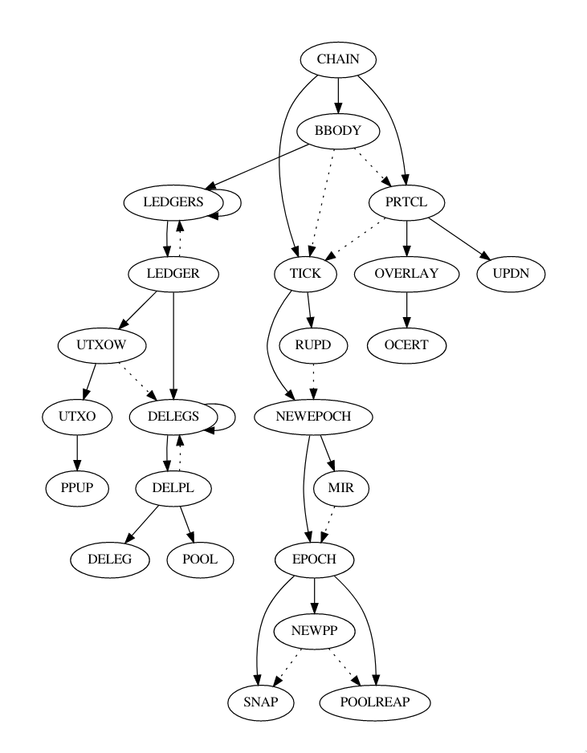

<!-- .slide: data-background-color="#8D3AED" -->

# 5. Blockchain Structure

---

<widget-text style="padding: 0 3em 0 3em">

**Goal:** Evaluate the blockchain structure of this project; name at least two things you like and two things you would want to improve.

## Things we like about the structure

- The separation of the CSL (Cardano Settlement Layer) and CCL (Cardano Computation Layer), which allows the node operators to decide if they want to take part in any type of transaction other than the ones that indicate value transfer.

- TODO

## Things we would improve

- TODO

- TODO

## Core elements
* What are the core elements of the application stack?

Cardano splits it's application into two main segments, the settlement layer and the computation layer.
Both run the Ouroboros Praos consensus algorithm.

### Cardano Settlement Layer (CSL)
This layer handles the accounting and ledger actions a blockchain will make throughout it's lifetime.

Their roadmap suggests that the settlement layer will include the following:

1. Support two sets of scripting languages, one to move value and another to enhance overlay protocol support.
**This is already implemented via the Marlowe and Plutus programming languages**
1. Provide support for KMZ sidechains to link to other ledgers
**This is not yet implemented**
1. Support multiple types of signature including quantum resistant signatures for higher security
**This is not yet implemented**
1. Support multiple user issued assets
**This is not yet implemented**
1. Achieve true scalability, meaning as more users join, the capabilities of the system increase
**This is not yet implemented**

### Cardano Computation Layer (CCL)
The CCL is inspired by the Rootstock[^5] smart contract platform on Bitcoin.
This will enable the development of specialized protocols that can help Cardano scale over the years. Among the discussed technology are Sealed Glass Proofs, which are a form of ZK proofs that utilize hardware security modules such as Intel's SGX.
The reasoning behind the CCL’s implementation lies in its ability to help scale specialized protocols over the years. This involves adding hardware security modules (HSM) to the existing stack of protocols as technology advances.

## Consensus algorithm
The consensus algorithm that is used is Ouroboros Praos[^2].

### Definitions
Beacon: Ouroboros uses a VRF, called beacon, to generate a random number.
The beacon regularly emits a new random value which is then used for
stakeholder elections.

Epoch: A point in protocol execution where the set of stakeholders eligible
to be block producers does not change. Each epoch has it's own beacon and lasts 5 days.
Currently we are on epoch 352 with epoch 353 starting 24-07-2022.

Slot: Every epoch is divided up equally to a number of slots.
Slots are block-producing oportunities - in each slot a block can (but doesn't have to)
be produced. Currently there are 432,000 slots per epoch, which equates to 1 slot a second.

Slot leader: the online stakeholder that is eligible to produce a new block.

Block: every slot should have a 5% chance of producing a block which includes the current state,
other data, the slot number and a signature from the block creator. This means a block is produced 
every 20 seconds.

### How it works

Praos introduces fundamental changes to the Ouroboros protocol when it comes to select the slot leader.

For every slot in the epoch:

1. the stakeholders are decided via VRF
1. there are 0 or more slot leaders selected for the slot
1. only the slot leader themselves will know that they are a leader
1. other slot leaders will not know if they have slot leader peers
1. participants will redetermine the stakeholder distribution if a new epoch has started
1. participants collect and verify all gossiped chains
1. participants compute the best chain via the `maxvalid` function, set that as the new local chain and update the state
1. if any blocks belong to a future slot, i.e. a slot that fulfills `current_slot < blocks[i].slot`, they get pruned.
1. if the online stakeholder is the slot leader, they will create a new block


## Block structure

The anatomy of a block is as follows[^1]:
```
{
    header: {
        prev    // hash of previous block header
        vk      // block issuer
        vrfVk   // VRF verification key
        blockno // block number
        slot    // block slot
        n       // nonce
        prf_n   // nonce proof
        l       // leader election value
        prf_l   // leader election proof
        bsize   // size of the block body
        bhash   // block body hash
        oc      // operational certificate
        pv      // protocol version
    },
    transactions: []
}
```

### Header
The previous block header is denoted by `prev` which is a BLAKE2b-256 hash of the previous block header,
which gets checked in the **chain** transition of the STF and will fail if the previous block hash does not match.

The protocol version is stored in `pv` which gets checked in the **chain** transition of the STF and will fail on a major version mismatch.

The `bsize` and `bhash` fields are checked in the **block body**  transition and will fail if they do not match.
`bsize` is also compared in the **chain** transition and will fail early if it does not match.

The **block body** also  extracts the `vk` block issuer and the `blockno` block number is checked.

The operational certificate, `oc`, is used by the **operational certificate** state transition to validate that the staking pool
that created the block was eligible to do so.

The slot leader is determined by a VRF. The inputs of the VRF are the block's `slot`, the VRF verification key `vrfVk` and the `nonce` which is derived from hash made of 2/3 of the blocks from the previous epoch.
This can be verified with the nonce proof `prf_n` and leader election proof `prf_l`.
This all happens in the **overlay** transition and it's sub transitions.

### Transactions
A set of UTXO based transactions.

## State transition function
The state transition function (STF)[^3] is defined by the **chain** transition.

                                                                                                    
*The state transition function as defined by the ledger specification[^3]*
                                                                                                    
### Chain transition [CHAIN]
Depends on:
- The **chain** transition is the base state transition in the STF and as such does not have any dependencies

Ensures that:

- The slot is incremented by one
- The block number is incremented by one
- The prev hash matches the hash of the previous block header
- The size of the block header is smaller than the maximum block header size of the protocol
- The size of the block body is smaller than the maximum block body size of the protocol.
At a later point, the block body size will be compared to the claimed size in the block header
- The protocol version field is not out of date, i.e. that the major version is larger than or equal to the MaxMajorPV constant.
- The **chain** transition calls the **block body**, **tick** & **protocol** sub-transitions

### Protocol transition [PRTCTL]
Depends on:
- The **block body**

Ensures that:
- The **overlay** sub-transition finishes
- The **update nonces** sub-transition finishes

#### Overlay transition [OVERLAY]
Ensures that:
- The **operational certificate** sub-transition finishes

##### Operational certificate transition [OCERT]
Ensures that:
- The KES period of the current slot in the block header must be greater than or equal to the value listed in the supplied operational certificate and less than the agreed upon lifetime of the operational certificate.
- The signature can be verified with the cold verification key
- The KES signature can be verified with the hot verification key

#### Update nonces transition [UPDN]
Ensures that:
- The nonces get updated until the randomness gets fixed

### Tick transition [TICK]
Depends on:
- The **block body**
- The **protocol**

Ensures that:
- The **reward update** sub-transition finishes
- The **new epoch** sub-transition finishes

#### Reward update transition [RUPD]
Ensures that:
- The current reward will be recalculated if the current slot algorithm allows it
- The current reward will not be recalculated if the current slot algorithm disallows it
- If the current reward has already been calculated, the state will not update

#### New epoch transition [NEWEPOCH]
Depends on:
-  The **reward update**

Ensures that:
- The **move instantaneous rewards** sub-transition finishes
- The **complete epoch boundary** sub-transition finishes

##### Move instantaneous rewards transition [MIR]
Ensures that:
- If the reserve and treasury pots can cover the sum of pending instantaneous rewards, the accounts affected are paid the correct amount and the reserve and treasury are drained. After, both of the instantaneous reward mappings are reset to the empty mapping

##### Complete epoch boundary transition [EPOCH]
Depends on:
- The **move instantaneous rewards** transition

Ensures that:
- The **new protocol parameter** sub-transition finishes
- The **snapshot** sub-transition finishes
- The **pool reaping** sub-transition finishes

##### New protocol parameter transition [NEWPP]
Ensures that:
- The new parameters will not incur a debt that cannot be covered by the reserves
- That the maximum block size is larger than the max transaction size and the max header size combined

##### Snapshot transition [SNAP]
A snapshot contains stake, delegation and pool parameter data.

Depends on:
- The **new protocol parameter** transition

Ensures that:
- The oldest snapshot is replaced by the middle snapshot
- The middle snapshot is replaced by the newest snapshot
- The newest snapshot is replaced by the just computed snapshot

##### Pool reaping transition [POOLREAP]
Responsible for removing pools that are to be retired in the current epoch.

Depends on:
- The **new protocol parameter** transition

Ensures that:
- Each retiring pool will refund it's deposit to the registered reward account if it still exists
- The sum total of refunds from retired pools with invalid reward accounts will go to the treasury
- The deposit pool is decremented by the sum total of claimed and unclaimed refunds
- All delegation certificates to the retiring pool are revoked
- The retiring pool is removed from all pool state mappings

### Block body transition [BBODY]
Ensures that:

- The block body size matches the value given in the block header
- The block body hash  matches the value given in the block header
- The **ledgers** sub-transition finishes

#### Ledgers transition [LEDGERS]
This is one of two recursive state transitions.

Depends on:
- The **ledger** transition

Ensures that:
- The **ledger** sub-transition finishes

#### Ledger transition [LEDGER]
Ensures that:
- The **unspent transaction output witness** sub-transition finishes
- The **delegators** sub-transition finishes

#### Unspent transaction output witness transition [UTXOW]
Ensures that:
- The transaction has valid signatures or multisigs
- The transaction's verification keys are a subset of the needed verification keys
- The set of scripts given by the transaction is equal to the set of required scripts
- All instantaneous reward certificates have consensus
- The transaction metadata hash is equal to the hash of the transaction metadata or both properties are absent
- The **unspent transaction output** sub-transition finishes

##### Unspent transaction output transition [UTXO]
Ensures that:
- The transactions supplied get converted to outputs
- The sum total of all the coin for every output is calculated
- The **protocol parameter update** sub-transition finishes

##### Protocol parameter update transition [PPUP]
Ensures that:
- If received *PP-Update-Empty*, do nothing
- If received *PP-Update-Current*, and it's still early in the epoch, add the parameters to the proposals with an override
- If received *PP-Update-Future*, add the parameters to the future proposals with an override. This proposal will then be dealt with in the next epoch

#### Delegations transition [DELEGS] [DELPL] [DELEG] [POOL]
This is one of two recursive state transitions.
For clarity, the sub transitions have been merged in to one as the only function is to split
delegation certificate handling from pool certificate handling.
Is used to handle stake delegation and pools.
Since pool certificates are disjoint from delegation certificates,
only one of the two rules will be successful.

Depends on:
- The **unspent transaction output witness** transition

Ensures that:
- The list of delegation/pool certificates is valid for every transaction that carries such a list

[^2]: Ouroboros Praos - https://eprint.iacr.org/2017/573.pdf

[^1]: Block specification - https://hydra.iohk.io/build/4975913/download/1/ledger-spec.pdf#subsection.12.2

[^3]: Transition rule dependencies - https://hydra.iohk.io/build/4975913/download/1/ledger-spec.pdf#section.14

[^4]: Application stack diagrams - https://www.altcoinbuzz.io/cryptocurrency-news/blockchain-technology/cardano-architecture-as-explained-by-iohk/

[^5]: Rootstock - https://www.rsk.co/

---
