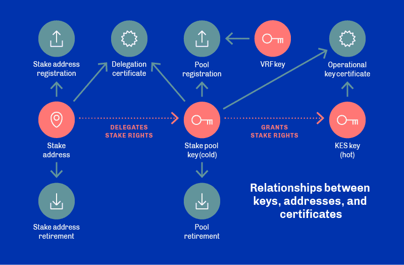

# Cryptography

---
## Primitives
Cardano uses asymmetric key and certification primitives to secure the interactions between network participant:

Source:[^1]

### Asymmetric Keys
Asymmetric keys are used by nodes and addresses:
- Node Keys:
  - **Stake pool key pair** (cold): used to create operational certificates for each KES period, granting stake rights
  - **Key Evolving Signature (KES) key pair** (hot): key used to authenticate node and for signing blocks, which 
    expires periodically (90 days)
  - **VRF key pair**: signing verification key, used to verify a slot leader and stored within *operational certificate*
- Address Keys:
  - **Payment key pair**: used for generating UTXO addresses
  - **Staking key pair**: generating stake account/reward addresses

### Certifications
Cardano uses certifications in two places: 
- **Operational certificates**:
  - Used by staking pools, generated offline before being copied to node to validate KES keys used to sign blocks
  - link between offline key and operational key, which verifies stake pool has authority to run
  - include an issue counter number, higher number replaces existing if compromised
  - included in header of each block node generates
- **Delegation certificates**:
  - Staking address registration certificate: creates a staking address by a user looking to delegate block-signing 
    rights to a stake pool
  - Delegation certificate: details stake being delegated to a particular stake pool

### Exotic Primitives

#### Verifiable Random Functions
Cardano uses the ECVRF-ED25519-SHA512-Elligator2 verifiable random function during block production:
* Used by Ouroboros Praos consensus mechanism for private slot leader selection. Leader selection was public in  
  previous versions of the protocol, so anyone could determine which node had the right to produce a block.
* Using VRFs keeps the slot leader schedule private until a leader is selected. The slot leader can then prove to 
  everyone that they are using the VRF key and produce a block.

### Digital Signatures
The chain currently only supports EdDSA and Curve25519 for signing and verification, but ECDSA SECP256k1 and Schnorr 
Ed25519 are due imminently for improved interoperability. Cardano also allows multi-signatures via multi-signature 
scripts.

* todo: Forward Secure Signatures?

### Hashing

Cardano uses BLAKE2b-224 as the hashing algorithm for:
- all verification keys (stake pools and VRF)
- multi-signature scripts
- payment and stake credentials 
- genesis keys and their delegates

BLAKE2b-256 is used everywhere else (e.g. block headers, block bodies, block transactions, epochs, transaction and 
pool metadata).

Cardano uses an **Extended UTXO**[^2] model and due to its 'stateless' nature, no hash-based data structures were 
found to be in use at this time.

### Pros/Cons
todo: name at least two things you liked and two things you would want to improve.

---
### Footnotes
[^1]: https://docs.cardano.org/core-concepts/cardano-keys
[^2]: https://docs.cardano.org/plutus/eutxo-explainer
[^3]: Source: https://hydra.iohk.io/build/5096921/download/1/ledger-spec.pdf