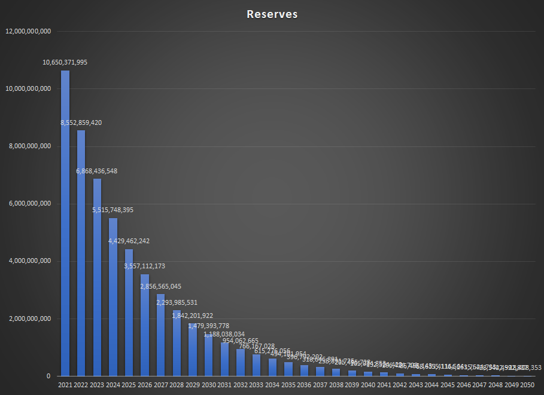
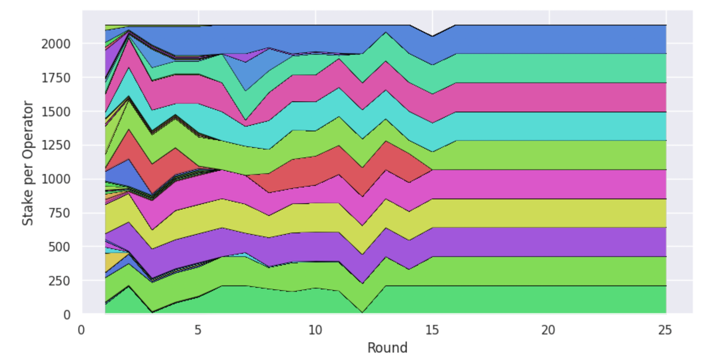

# Economics

---

## Tokenomics

### Native Token
The native token is ADA, named after Ada Lovelace, an English mathematician[^1], which is used for fees, rewards
and deposits.

Cardano does also have multi-asset support via "native tokens"[^2], but usage does not have any direct economic impact on
the network.

### Tokenomics:

#### Token Usage

* **Staking**: ADA stakers delegate to stake pools and earn rewards for securing the network
* **Fees**: transaction fees paid in ADA
* **Governance**: ADA stakers participate in governance and vote on CIPs

#### Distribution
There was a public sale of 25.9 billion ADA and an additional 5.2 billion ADA (20% of public) was allocated to the
three entities supporting the ongoing development of the project:

| Seed Sale                                           | Amount                   |
|-----------------------------------------------------|--------------------------|
| Public                                              | 25.9 billion ADA (57.6%) |
| [IOHK](https://iohk.io) (development company)       | 2.46 billion ADA (5.5%)  |
| [EMURGO](https://emurgo.io) (commercial adoption)   | 2.07 billion ADA (4.6%)  |
| [Cardano Foundation](https://cardanofoundation.org) | 640 million ADA (1.4%)   |
| Reserve / Uncirculated                              | 13.9 billion ADA (30.9%) |

#### Supply Schedule
Cardano currently has approximately 75% of its tokens in circulating supply:

| Supply              | Amount                |
|---------------------|-----------------------|
| Initial Supply      | 31.8 billion ADA      |
| Circulating Supply* | 33.93 billion ADA[^5] |
| Max Supply          | 45 billion ADA        |

'* The top 100 addresses on network hold ~17% circulating supply.

Expansion of the circulating supply comes from the *reserve*, where `reserve = max supply - total supply` and
`total supply = ADA in circulation plus ADA in treasury`. Expansion is non-linear, greater amounts released during
first years but decreases over time until most rewards will come from transaction fees. The supply schedule can 
therefore be described as monotonically decreasing inflation.

Source: https://forum.cardano.org/t/how-does-cardano-reach-its-supply-cap-via-staking/39697/8

### Rewards
Stake pools earn block rewards in the form of *expansion* and *fees*, which are shared between the stake pool operator
and the stakers which delegated to the pool. Stake pool operators take a commission for running staking pools.

0.3% of the reserve is distributed each epoch, as staking rewards and treasury funding: 80% to stake pool 
operators/delegators and 20% to the treasury. The treasury (aka 'pot') is used for funding projects, improvements 
and the long term sustainability of Cardano.

Rewards will therefore ultimately be comprised solely of transaction fees, once the reserve supply has been 
depleted.

#### Staking Mechanics
Cardano uses stake pools as a mechanism for the distribution of rewards among stake participants, optimised by 
protocol-specific parameters which can be tuned as required:

**Stake Pools:**

Protocol Parameters:
  * **Pledge Influence Parameter *a0***:
    * Rewards are adjusted based on pledge amount (i.e. influence of pledge on pool rewards), which encourages 
      operators to control fewer pools with higher pledge
    * Increasing pledge amount increases rewards by a factor of up to *a0*, currently set to 0.3
    * Mechanism to prevents Sybil attacks on the network
  * **Saturation Parameter *k***:
    * Saturation is the level at which the rewards distributed to a pool's delegators starts to decrease 
      (diminishing returns)
    * encourages growth in number of pools, and therefore distribution of delegated stake, by setting optimal number
      of pools
    * This results in a cap at which point the stake pool no longer earns rewards, which incentivizes the creation of new pools
    * The parameter therefore defines number of pools and estimated cap of stake to guarantee decentralisation

Stake Pool Operator:
  * **Pool Fixed Cost**: fixed cost per pool (340 ADA), covering operating costs
  * **Pool Margin**: commission fee determined by the stake pool operator, after fixed costs
  * **Pool Pledge**: 
    * validators own stake and commitment to the pool for as long as it operates 
    * No minimum, but pools with higher pledge will receive higher rewards

**Delegators:**

Factors considered by the delegator:
  * **Pool Performance**: a stake pool operator which misses slots is missing out on rewards, which are shared with
    the pool.
  * **Decentralisation**: current configuration of pools and their centralisation around larger operators, for the 
    sake of the protocol. A delegator can also delegate to multiple pools.
  * **Fees**: fixed fees (amount taken from total epoch rewards) and margin (amount taken from total epoch rewards after
    fixed fees deducted, used to cover pool running costs). The remaining rewards are distributed to delegated stakers.
 
Benefits: 
  * 3-5% APY return for staking, depending on the stake pool
  * No lock-up/unbounding period

Delegators are therefore free to move their stake to another pool if existing pool operator does not provide a fair 
return or behave in the interests of protocol. A snapshot of pool participants is taken at each epoch (and used with delay of one epoch), so stake pool operator could 
lose staking 'power' relatively quickly (within 2 epochs or 10 days).

## Economic Incentives
Cardano has aligned its economic incentives to encourage decentralization, which it deems as critical to the long-term
success of the project. Rewards are therefore shared between delegators and stake pool operators, a symbiotic
relationship maximising rewards so long as they are rational (Nash equilibrium).

This design also allows economic specialisation: stake pool operators have the time, technical expertise and 
capital to run nodes which secure the network. Delegators may have none of these, instead delegating 
their stake to a stake pool to increase the overall pool stake, thereby increasing the probability of the stake pool 
being elected to earn block rewards.

Cardano's incentive mechanism seeks a balance across staking pools, where an equilibrium means that rewards are 
optimal for all when stake delegated evenly across pools. A cap on stake pool size 

* Staking pool operators are incentivized to remain online in order to be elected as a slot leader, thereby being
  granted the right to produce a block and claim the corresponding reward.

Stake pools can determine own commission rates and stakers can delegate their stake to any staking pool with no
  lock-up period. This means they are free to switch to another pool at any time, should a pool with a more
  attractive rate become available. This leads to a natural market equilibrium as stakers delegate to pools with the
  most favourable rates.

* Perfect competition: stake pools arrange until an equal distribution across pools
* No slashing: protocol incentivizes validators to stay honest and online. Penalisation of malicious participants
  unnecessary provided desired number of pools exist, and they are in Nash equilibrium[^6]

## Pros and Cons

* Rewards shared between stake pool operators and delegators, no lock up period so delegators can easily re-stake with
  another operator if a stake pool performs poorly or its operator behaves maliciously (liquid democracy).
* No slashing, reducing delegator staking risk.

---
### Footnotes
[^1]: https://cardanians.io/en/the-story-of-ada-lovelace-40
[^2]: The accounting model is extended to accommodate transactions using custom token types (with their own monetary
policy), without the need for smart contracts. Multiple token types can be included within the same transaction. https://github.com/input-output-hk/cardano-ledger/blob/master/doc/explanations/features.rst
[^3]: https://www.figment.io/resources/cardano-ada-tokenomics
[^4]: https://www.cryptoeq.io/corereports/cardano-abridged
[^5]: https://messari.io/asset/cardano/chart/sply-circ
[^6]: https://medium.com/coinmonks/why-cardano-does-not-need-slashing-85630ff55092