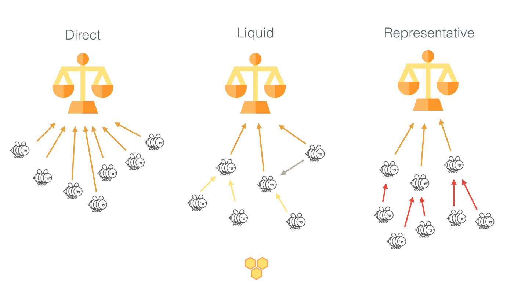

<!-- .slide: data-background-color="#8D3AED" -->

# Governance

---
### How does this project solve the collective decision making problem?

The collective decision making problem appears in two different places for the Cardano community's governance system:

- The commmunity must collectively decide on funding proposals (FP)
- The Cardano foundation collectively (we hope) decides on Cardano improvement proposals (CIPs)
- We focus on FPs

---
### Funding Proposals

- Community members can contribute funding proposals on a platform called Project Catalyst (this is off-chain)

- Decision regarding which proposals to support is solved primarily by using three/four "structures":
    - Liquid democracy
    - Treasury system
    - Cryptography 
    - Sidechain (Voltaire)

- Rewards are introduced to sustain participation, and they are proportional to stake 
 
---
### Treasury funding mechanism
- The treasury is used as a decentralized trust, and is funded in three different ways:
    - By taxing block authors' rewards (decentralized)
    - By transferring a fixed portion of the block rewards to the treasury accounts (decentralized)
    - Through donations (external, ie. not part of the protocol)

---
### What voting mechanisms are used in this project?

- Liquid democracy
    - A blend of direct and representative democracy.
    - Voters can vote directly for proposals, or delegate to experts.
    - Experts receive delegated stake, and can delegate their previously received stake to other experts if necessary.

---
- Example: 
    

---

- Why liquid democracy?
    - Improve Pareto efficiency (likelihood of collectively optimal outcome)
        - Uninformed voters can still contribute positively by delegating to someone more knowledgable
    - Encourage developing expertise
        - Higher rewards as experts, but still bound by upper limit

---
- Fuzzy threshold voting
    - Ranks proposals based on:

        ***Remainder = (Votes for each proposal - Votes against each proposal) % Total number of votes***
        
    - Remainder must be > 10% of all votes recorded for a proposal to be shortlisted for funding

---
### How are changes proposed and voted on?

- Four primary participants in a "governance round":
    - Project proposers (mentioned)
    - Voters  (mentioned)
    - Experts (mentioned)
    - Committee members (NOT mentioned yet, but crucial)

---

- Committee members are primarily responsible for tallying votes, and guaranteeing liveness of the governance system. 
- Committee members are elected voters, where the probability of being elected is relative to the amount staked in a deposit round.
- To maintain trust in committee members, a set of cryptographic primitives are used

---
### Cryptography used by Committee members

- Security properties of cryptographic hash functions
    - The committee election phase is based on them
- Distributed Key Genereation with threshold
- Non-interactive zero knowledge proofs (NIZK)

The last two are used to verify that community members are acting honestly during the tallying phase.

---
### Who is allowed to vote in this project? What are the voting criteria?

- Voters and experts are allowed to vote
- Voting power is propotional to stake
- Any Cardano community member who can pledge/stake a minimum of 500 ADA (Cardano's native token) is eligible
- ...How to become a community member? 
    - Have to join Project Catalyst: https://cardanocataly.st/

---

### What we liked about the Cardano governance system

- Interesting and innovative cryptographic research and protocols
- The introduction of liquid democracy into an e-voting system

### What we didn't like 

- Implementation vs. theory
- Seemed to be a few issues regarding committee members:
    - NIZK protocol can be used to maliciously complain about honest committee members
    - Decryption of shared key for a new governance round to commence 
